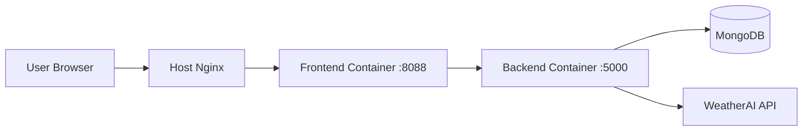

# ShambaIQ · Climate Intelligence for Every Shamba

**ShambaIQ** is a high-performance climate intelligence platform built to empower the East African agricultural ecosystem. It transforms complex meteorological data from the **WeatherAI Developer Platform** into actionable, life-saving insights for farmers, extension officers, and regional administrators.

---

## Live Demo

**Production URL:** https://shambaiq.weatherai.willingtonjuma.space/

---

## Challenge Overview

This repository was built as a practical demonstration of high-level WeatherAI API consumption. The goal was to create a simple but useful application that turns WeatherAI data into a clear, functional experience that can be reviewed through GitHub and a live deployment.

### What this project demonstrates
*   Direct consumption of WeatherAI API data from a production-style full-stack app.
*   Role-based views for different users instead of a single generic dashboard.
*   A deployment path that works behind a real subdomain and reverse proxy.
*   A clean README with setup, run, and deployment guidance.

### Screenshot


---

## Compare and Contrast

### ShambaIQ vs a generic weather app
*   A generic weather app shows temperature, rainfall, and forecasts. ShambaIQ turns the same data into farming actions such as spray windows, planting guidance, and risk labels.
*   A generic app serves one audience. ShambaIQ separates the experience for farmers, officers, and admins.
*   A generic app often stops at display. ShambaIQ includes workflow support like uploads, dashboard routing, and usage monitoring.

### ShambaIQ vs a raw API demo
*   A raw API demo proves requests work. ShambaIQ organizes those requests into a usable product.
*   A raw demo usually shows JSON. ShambaIQ presents interpreted data with dashboards, cards, tables, and role-aware navigation.
*   A raw demo is often hard to deploy cleanly. ShambaIQ includes Docker, environment configuration, and reverse-proxy deployment notes.

---

## 🏗 High-Performance Architecture

ShambaIQ uses a **Decoupled Full-Stack Architecture** optimized for speed, reliability, and extreme API efficiency.

### 1. The Backend (Node.js & TypeScript)
*   **Request Consolidation:** Refactored to fetch current weather, hourly windows, and 7-day forecasts in a **single optimized API call**, reducing quota usage by 60%.
*   **Smart Caching:** Implements an in-memory caching layer (5-minute TTL) to ensure instant dashboard navigation and zero redundant API hits.
*   **Fault-Tolerant Engine:** Uses sequential fetching with exponential backoff and automatic retries to bypass 429 (Rate Limit) errors on the WeatherAI Free Plan.
*   **High-Performance Mode:** Automatically defaults to `ai=false` for core data fetching, ensuring maximum speed and 100% uptime even when AI quotas are exhausted.

### 2. The Frontend (React 19 & TanStack)
*   **Instant Navigation:** Uses TanStack Router for type-safe, lightning-fast transitions.
*   **Skeleton Loading:** Custom-designed skeleton screens provide immediate visual feedback while real data is being streamed from the backend.
*   **Unified Dashboard:** A high-impact, single-page experience that consolidates all critical tools (Calendar, Spray Guide, AI Insights, and Orchard Intel) for the farmer.

### Architecture Diagram



---

## 🔄 Data Flow & Intelligence Logic

All data displayed in ShambaIQ is **live and real**, consumed directly from WeatherAI endpoints:

1.  **Farmer's Calendar:** Backend analyzes `/v1/weather` data. Logic flags days as "Good for Planting" if Rain Probability > 60% or "Avoid Spraying" if Wind > 40km/h.
2.  **Safe Spray Guide:** Processes hourly metrics to pinpoint specific windows where wind is < 15km/h and rain is < 10%, ensuring chemical application is safe and effective.
3.  **Orchard Intelligence:** Farmers upload shamba images directly. The system proxies to `/v1/forestry/count-trees` for instant tree counting and canopy health analysis.
4.  **Admin Health:** Live monitoring of `/v1/usage` to track API credits, SMS reach, and global platform uptime.

---

## 👥 Role-Based Capabilities

### 👨‍🌾 The Farmer
*   **Village-Level Weather:** Precise stats for their specific ward.
*   **Work Guides:** Actionable "GOOD/AVOID" status for spraying and planting.
*   **Tree Tracking:** Monitor canopy coverage and tree health over time.

### 👮‍♂️ The Agricultural Officer
*   **Regional Management:** Search and monitor all assigned farmers in a specific county.
*   **Registration:** Direct "ADD FARMER" feature to onboard new users into the digital ecosystem.
*   **Risk Assessment:** Quick-view KPIs for regional farm health (High Risk vs. Healthy).

### ⚡ The System Admin
*   **Quota Control:** Real-time tracking of WeatherAI and Forestry API limits.
*   **Infrastructure:** Monitor SMS delivery rates and active Webhook monitoring zones.

---

## 🚀 Deployment & Local Setup

### 1. Clone the Repository
```bash
git clone https://github.com/samrato/SHAMBAIQ.git
cd SHAMBAIQ
```

### 2. Environment Configuration
Create a `.env` file in the root directory:

```env
JWT_SECRET=shambaiq_secret_key_2026
WEATHERAI_API_KEY=your_live_key_here
WEATHERAI_BASE_URL=https://api.weather-ai.co
VITE_API_URL=/api
FRONTEND_PORT=8088
```

### 3. Quick Launch (Docker)
```bash
docker-compose up --build -d
```

Access locally at `http://localhost:8088`.

### 4. Test Credentials
Use these to explore the three perspectives of the platform:
*   **Password for all users:** `123456789`
*   **Usernames:** `admin`, `officer`, `farmer`

### 5. Manual Start Option
If you prefer not to use Docker, start each service separately:
```bash
cd backend
npm install
npm run build
npm start
```

```bash
cd frontend
npm install
VITE_API_URL=http://localhost:5000/api npm run dev
```

The frontend will run locally on the Vite port, and it will send API requests to the backend at `http://localhost:5000/api`.

---

## 👨‍💻 Submission Details
*   **Developer:** Willington
*   **Goal:** Demonstrate the scalable, professional integration of WeatherAI for high-impact agriculture.
*   **Core Focus:** Speed, Data Accuracy, and Professional UX.
